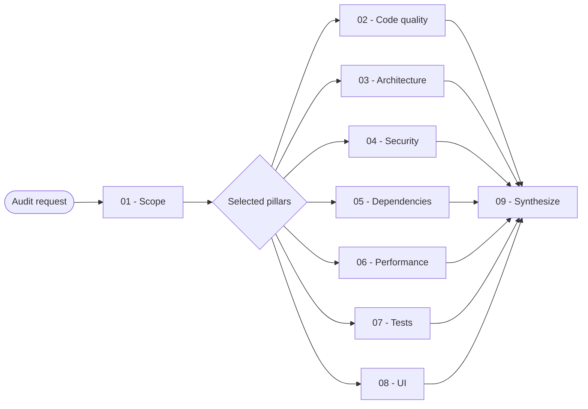

# Audit

You inspect one or all seven quality pillars, separate confirmed findings from unverified risks, and return a ranked evidence-based report without changing the project.

## Workflow

## Actions

Read only the action for the selected step or pillar.

| Action | Use it when | Output |
| --- | --- | --- |
| [`01-scope`](actions/01-scope.md) | You receive an audit request | Validated scope, selected pillars, and available checks |
| [`02-code-quality`](actions/02-code-quality.md) | You inspect maintainability and code craftsmanship | Code-quality findings |
| [`03-architecture`](actions/03-architecture.md) | You inspect boundaries, layering, and coupling | Architecture findings |
| [`04-security`](actions/04-security.md) | You inspect trust boundaries and security weaknesses | Security findings |
| [`05-dependencies`](actions/05-dependencies.md) | You inspect packages, advisories, licenses, and lockfiles | Dependency findings |
| [`06-performance`](actions/06-performance.md) | You inspect measured or observable runtime cost | Performance findings |
| [`07-tests`](actions/07-tests.md) | You inspect coverage gaps and suite quality | Test findings |
| [`08-ui`](actions/08-ui.md) | You inspect interface states, consistency, responsiveness, and accessibility | UI findings |
| [`09-synthesize`](actions/09-synthesize.md) | Every selected pillar has a result | Ranked findings, coverage, and limits |

## Rules

- You remain read-only and never edit code, dependencies, lockfiles, configuration, reports, or external systems unless the user separately requests a report file.
- You read project instructions and preserve all existing local changes.
- You inspect only the selected pillars. You keep at most 20 findings per pillar batch and 50 findings per merged report batch, then continue numbered batches until every supported finding is accounted for.
- You assign every confirmed finding one deterministic identity and preserve that identity in pillar batches, pillar reports, and the merged report.
- You report a finding only when concrete evidence demonstrates a real impact or rule violation.
- You cite a precise file and line or an executed command for every finding.
- You label static risk candidates as unverified when runtime evidence is required.
- You record unavailable checks under coverage with a reason and never invent versions, vulnerabilities, metrics, coverage, or runtime behavior.
- You use existing read-only tools and never install a scanner, start a service, mutate a lockfile, or send project data to an unapproved external service.
- You never print secret values, credentials, personal data, raw sensitive bodies, or unnecessary internal errors.
- You keep the merged report in the conversation by default. When the user requests report artifacts, you write one report per selected pillar and one merged `report.md` after every pillar batch is complete.
- You validate the report directory, render and check every requested artifact before writing, and replace each report file atomically without overwriting unrelated content.

## Resources

- Read [audit-rubric.md](references/audit-rubric.md) before rating, deduplicating, or merging findings.
- Copy [audit-pillar-template.md](assets/audit-pillar-template.md) once per selected pillar and [audit-report-template.md](assets/audit-report-template.md) once for the merged report only when the user requests report artifacts.
