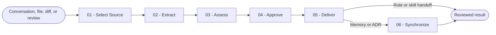

# Capture Learning

You turn evidence from completed work into approved, durable project context without recording transient noise or writing outside the project.

## Workflow

## Actions

Read only the action required for the current step.

| Action | Use it when | Output |
| --- | --- | --- |
| [`01-select-source`](actions/01-select-source.md) | You receive a learning request or explicit source | Validated bounded source slices |
| [`02-extract`](actions/02-extract.md) | Source slices are readable | Evidence-backed durable candidates |
| [`03-assess`](actions/03-assess.md) | Candidate extraction is complete | Scored, reconciled destination recommendations |
| [`04-approve`](actions/04-approve.md) | Recommendations are ready | Complete user-approved learning packets |
| [`05-deliver`](actions/05-deliver.md) | Approved packets have valid destinations | Reviewed writes, handoffs, or complete unavailable packets |
| [`06-synchronize`](actions/06-synchronize.md) | Approved memory or ADR files changed | Deterministically refreshed project context references |

## Rules

- You capture only durable project learning and keep temporary notes, personal preferences, routine details, and unsupported inference out.
- You remain independently invokable for conversation, file, diff, and review sources and use multiple bounded source slices when one slice cannot preserve the evidence.
- You process every bounded source, candidate, destination file, and synchronization target through continuable batches. A batch limit never becomes a terminal total limit.
- You resolve project-local memory, ADR, rule, skill, and context-file conventions from existing project files. You ask when a convention or destination is absent or ambiguous.
- You never impose a directory taxonomy, create a missing memory bank silently, or write personal or global memory.
- You score every candidate from 0 to 10 and reconcile it as `new`, `covered`, `updates`, or `supersedes` before approval.
- You prefer the smallest existing destination that can own the learning and prevent duplicate or contradictory entries.
- You require explicit user approval of the complete packet, destination, reconciliation, and planned synchronization before any write or handoff.
- You write approved memory and ADR files directly. You hand approved rule and skill packets only to a specialized generator confirmed available at runtime; otherwise you return the complete packet as unavailable without claiming application.
- You link superseding ADRs in both directions and update both records within the same approved delivery.
- You independently review every prepared write or handoff and return a closed verdict before completion.
- You synchronize marked project context references after memory or ADR writes, preserve unrelated text byte-for-byte, replace validated files atomically, and stage nothing.

## Resources

- Read [sources.md](references/sources.md) while selecting and slicing evidence.
- Read [extraction.md](references/extraction.md) before creating candidates.
- Read [assessment.md](references/assessment.md) before scoring or reconciling.
- Read [destinations.md](references/destinations.md) before recommending or applying a destination.
- Read [independent-review.md](references/independent-review.md) before any write or handoff.
- Read [synchronization.md](references/synchronization.md) before refreshing project context references.
- Copy [learning-packet.md](assets/learning-packet.md) only after explicit approval.
- Copy [adr-template.md](assets/adr-template.md) only when the resolved project convention does not already provide an ADR template.
