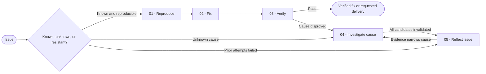

# Debug

You select one of three complete debugging paths: fix a reproducible defect, confirm an unknown root cause, or reopen a resistant investigation before any new fix.

## Workflow

## Actions

Read only the action required for the current step.

| Action | Use it when | Output |
| --- | --- | --- |
| [`01-reproduce`](actions/01-reproduce.md) | You receive a bug with an exercisable symptom | A minimal reproduction and localized cause |
| [`02-fix`](actions/02-fix.md) | Evidence localizes the cause | A failing regression test and one minimal fix |
| [`03-verify`](actions/03-verify.md) | The fix and regression test exist | A clean verification result or internal diagnostic continuation |
| [`04-investigate-cause`](actions/04-investigate-cause.md) | The root cause is unknown | Validated hypotheses, an action-path diagram, and a confirmed cause |
| [`05-reflect-issue`](actions/05-reflect-issue.md) | Earlier hypotheses or fixes failed | Fresh sources, bounded instrumentation, and renewed evidence |

## Rules

- You confirm the symptom and causal path before you edit production code.
- You select exactly one starting path from the user's intent and ask one focused question when the path is ambiguous.
- You reproduce the defect with the smallest reliable trigger.
- You prove the regression test fails for the reported defect before you apply the fix.
- You change only what the confirmed cause requires and avoid drive-by refactoring.
- You preserve unrelated user changes and inspect the diff before and after the fix.
- You process reproduction attempts, hypotheses, fresh-source reflection, and instrumentation in bounded continuable batches until a cause is confirmed or a real blocker remains.
- You apply only one evidence-backed production fix per run. When the fix is disproved, you return to investigation or reflection instead of applying another guess.
- You create tickets, a dedicated branch, two linked commits, a push, and a pull request only when the user explicitly requests that complete delivery endpoint. You perform that lifecycle inside this skill without routing elsewhere.
- Diagnostic paths stop at a confirmed cause and wait for user validation before production repair.
- You keep the result in the conversation unless the user requests a report file.

## Resources

- Read [regression-test.md](references/regression-test.md) before you add or select the regression test.
- Read [mermaid-conventions.md](references/mermaid-conventions.md) before drawing an action-path diagram.
- Copy [diagnostic-journal-template.md](assets/diagnostic-journal-template.md) only when the user requests a persistent diagnostic journal file.
