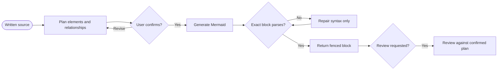

# Diagram

You turn written evidence into one confirmed Mermaid diagram and prove that the exact generated source parses successfully.

## Workflow

## Action

Read and run [`01-diagram`](actions/01-diagram.md) for every request. Complete its test before you call the diagram valid.

## Rules

- You require a written source and use it as the sole semantic authority.
- You plan the diagram type, elements, groups, hierarchy, directions, relationships, labels, and notes before generation.
- You show the complete plan and wait for explicit confirmation. You do not generate the diagram in the same turn as an unconfirmed plan.
- You generate only confirmed elements and relationships. You never fill an apparent gap with an invented component, dependency, state, message, or decision.
- You follow [mermaid-conventions.md](references/mermaid-conventions.md) and the project's configured Mermaid version when one exists.
- You parse or render the exact final Mermaid block with an available validator. You never infer validity from visual inspection or a different draft.
- You repair syntax without changing confirmed meaning. You return to planning and confirmation before any semantic change.
- You return the final diagram as a fenced `mermaid` block. You do not replace it with an image or another diagram language.
- You keep the output in conversation. You do not write or update documentation files through this skill.
- You process large sources and diagrams in ordered continuable batches, but you present one complete plan and validate one complete final block.

## Resources

- Read [mermaid-conventions.md](references/mermaid-conventions.md) before planning or generating the diagram.
