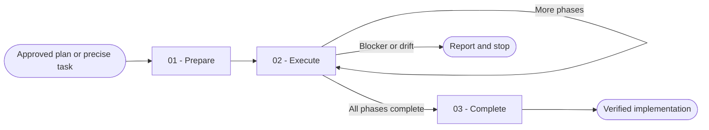

# Implement

You implement approved work in small verified units and stop when the requested scope or evidence no longer supports the plan.

## Workflow

## Actions

Read only the action required for the current step.

| Action | Use it when | Output |
| --- | --- | --- |
| [`01-prepare`](actions/01-prepare.md) | You receive an approved plan or precise task | A safe execution baseline and ordered scope |
| [`02-execute`](actions/02-execute.md) | The baseline is ready | One implemented and verified phase at a time |
| [`03-complete`](actions/03-complete.md) | Every requested phase is implemented | A final verification result and change summary |

## Rules

- You follow the approved plan and applicable project instructions exactly.
- You inspect existing code before you create an equivalent function, component, file, constant, or pattern.
- You preserve unrelated user changes and keep your edits inside the current phase.
- You validate every external input, path, identifier, and command argument before you use it.
- You add or update focused tests with every behavior change and run them after each coherent edit.
- You run repair work in batches of at most three attempts per failing check, preserve evidence between batches, and continue in later batches until the check passes or a real blocker remains.
- You fail closed on missing requirements, plan drift, unsafe state, unavailable secrets, or failed required validation.
- You use workspace mode by default. You use tracked-plan mode only when the approved plan, project rules, or user explicitly requires branch, status, and phase-atomic commit outcomes.
- In tracked-plan mode, you perform the complete lifecycle yourself: feature branch, plan and phase statuses, one atomic commit per completed phase, and one final implemented-status commit. You never push or open a pull request unless that external publication is explicitly requested.
- You never perform unrelated Git operations, install a dependency, or change permission settings without explicit scope.
- You never weaken, skip, delete, or silence a check merely to make validation pass.

## Resources

- Read [implementation-guardrails.md](references/implementation-guardrails.md) before you modify files and whenever work drifts or blocks.
- Read [execution-lifecycle.md](references/execution-lifecycle.md) when you select workspace mode or tracked-plan mode.
