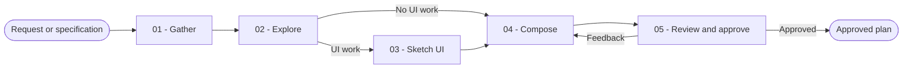

# Plan

You turn an approved source into an implementation-ready sequence without changing the product or the code.

## Workflow

## Actions

Read only the action required for the current step.

| Action | Use it when | Output |
| --- | --- | --- |
| [`01-gather`](actions/01-gather.md) | You receive the planning source | A faithful scope summary with unresolved blockers |
| [`02-explore`](actions/02-explore.md) | The source is usable | A repository-grounded impact map |
| [`03-sketch-ui`](actions/03-sketch-ui.md) | The work changes a user interface | A low-fidelity structural sketch |
| [`04-compose`](actions/04-compose.md) | The scope and impact are known | A complete candidate plan with observable acceptance checks |
| [`05-review`](actions/05-review.md) | The candidate plan is complete | A calibrated confidence review and explicitly approved plan |

## Rules

- You plan only from confirmed requirements and inspected project evidence.
- You identify decisions that materially change scope and ask before you plan through them.
- You search for existing components, functions, tests, and conventions before you propose new ones.
- You keep every phase independently understandable, implementable, and verifiable.
- You show the complete candidate plan, report calibrated confidence, collect feedback, and revise until the user explicitly approves it.
- You name likely files only when repository evidence supports them. You label uncertain locations explicitly.
- You remove secrets and sensitive values from summaries, plans, files, and user-visible errors. You describe the secret's role without repeating its value.
- You process at most 50 source requirements and 100 projected files per batch.
- You process at most 20 phases per numbered batch and 50 tasks per phase, then continue later batches until every phase is covered. A batch limit never becomes a total-plan limit.
- You do not write source code, change project configuration, create a branch, commit, or install dependencies. A validated plan destination explicitly requested by the user is the only permitted file change.
- You keep the result in the conversation by default. You persist it only when the user requests a file or an established project workflow requires a plan artifact.
- You write a single requested plan file with the single-file template. When the user requests a source-style bundle or the established workflow requires one, you write one `plan.md` index and one `phase-<number>.md` file per phase.
- You validate every requested destination, render and check every artifact before writing, and replace each destination file atomically without overwriting unrelated content.

## Resources

- Read [phase-design.md](references/phase-design.md) before you split work into phases.
- Read [ui-sketches.md](references/ui-sketches.md) only when the work changes a user interface.
- Copy and fill [plan-template.md](assets/plan-template.md) only for one requested plan file.
- Copy and fill [plan-index-template.md](assets/plan-index-template.md) and [phase-template.md](assets/phase-template.md) for a requested or required source-style bundle.
