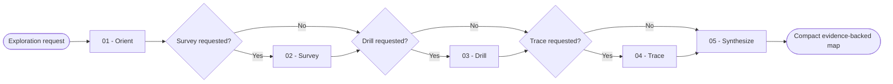

# Project Explorer

Build a compact, evidence-backed map across Tooling, Context, and Codebase. Point to available capabilities and explain project relationships without executing, judging, or changing the discovered targets.

## Workflow

## Axes

- **Tooling:** You map available skills, project instructions and rules, active tools, connectors, MCP capabilities, plugins, hooks, commands, and project knowledge tools.
- **Context:** You map project instructions, memory, specifications, plans, indexed documentation, and other context sources actually present.
- **Codebase:** You map the stack, packages, entry points, modules, tests, data boundaries, and requested execution paths.

## Actions

Read each action required by the request. Run Survey, Drill, and Trace sequentially when the user asks for several outputs, then synthesize once.

| Action | Use it when | Output |
| --- | --- | --- |
| [`01-orient`](actions/01-orient.md) | You enter a project or receive an exploration question | A validated root, axes, scope, and source plan |
| [`02-survey`](actions/02-survey.md) | The user wants a broad overview | A bounded three-axis inventory |
| [`03-drill`](actions/03-drill.md) | The user names an axis, item, or goal | One complete level, an optional best match, and available deeper levels |
| [`04-trace`](actions/04-trace.md) | The user asks where or how one behavior works | An evidence-backed relationship or execution path |
| [`05-synthesize`](actions/05-synthesize.md) | All requested surveys, drill levels, and traces are complete | One concise result with evidence and known gaps |

## Rules

- Remain read-only. Never create, edit, delete, install, run migrations, start services, or execute a discovered target capability.
- Invoke the read-only exploration tools required to inspect evidence, including search, symbol inspection, and an available project knowledge graph.
- Read project instructions before inspecting the files they govern.
- Validate the root and every user-supplied path, reject traversal, and stay inside the requested project.
- Detect only surfaces available in the current session or present in the project. Never invent or hardcode an unavailable tool.
- Search before opening files and read only the sections needed for the requested level.
- Derive facts from catalogs, files, configuration, symbols, tests, and tool output. Label inference explicitly.
- Ignore generated output, dependency caches, binaries, vendored code, and large data files unless the request targets them.
- Never read or reproduce secret values, environment files, credentials, personal data, or unrelated user content.
- Map at most 20 top-level areas, 50 relevant files, or 100 direct matches in one pass. Continue with a narrower level when the user requests more.
- Use a project knowledge graph only when it exists and the requested relationship spans modules; otherwise use direct file and symbol search.
- Describe and point. Do not prescribe a next step, claim quality from structure, or run the item you identify.

## Resources

- Read [exploration-strategy.md](references/exploration-strategy.md) when you choose evidence, exclusions, or depth.
- Read [tooling-surfaces.md](references/tooling-surfaces.md) when you survey or drill into Tooling or Context.
