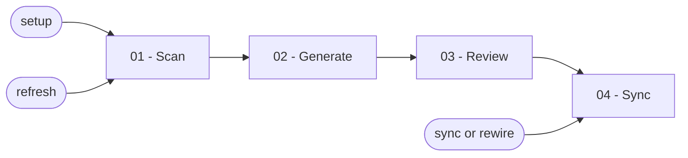

# Project Memory

Build durable project context from repository evidence, preserve user work during refreshes, and keep the current memory file list synchronized into chosen project instruction files.

## Workflow

## Actions

Read every action used by the selected path before you run it.

| Action | Use it when | Output |
| --- | --- | --- |
| [`01-scan`](actions/01-scan.md) | Start setup or refresh | Confirmed capabilities, destination, and instruction targets |
| [`02-generate`](actions/02-generate.md) | Finish a confirmed scan | A complete new or refreshed memory bank |
| [`03-review`](actions/03-review.md) | Finish generation or refresh | Independently reviewed files and approved safe corrections |
| [`04-sync`](actions/04-sync.md) | Finish review or run sync/rewire alone | Current memory references in chosen project instruction files |

## Dispatch

- Run `01-scan`, `02-generate`, `03-review`, then `04-sync` for setup or refresh.
- Run `04-sync` alone for sync, rewire, or context-file repair.
- Treat a request to edit one known memory note as outside this skill.

## Rules

- Ground every claim and capability in repository evidence. Ask when evidence is ambiguous and stop when required evidence is unreadable.
- Resolve one existing repository convention before asking. When none exists, ask for both the memory-bank destination and the project instruction files to update.
- Keep every read and write inside the canonical project root. Never inspect or update personal, home-level, global, or cross-project memory.
- Process at most 100 discovered paths, 50 evidence records, or 20 memory files per numbered batch, then continue until the entire ordered scope is complete.
- Preserve existing user text exactly unless the user explicitly approves a specific replacement or deletion.
- Flag obsolete known memory files and delete them only after an explicit request naming the files.
- Write requested files atomically, preserve unrelated text, and never stage, commit, or push changes.
- Finish every path with the report defined in [report-template.md](assets/report-template.md).

## Resources

- Read [destination-resolution.md](references/destination-resolution.md) whenever you resolve paths or project conventions.
- Read [capability-signals.md](references/capability-signals.md) during scanning.
- Read [memory-map.md](references/memory-map.md), [memory-rules.md](references/memory-rules.md), and [refresh-preservation.md](references/refresh-preservation.md) during generation or refresh.
- Read [review-protocol.md](references/review-protocol.md) before independent review.
- Read [sync-contract.md](references/sync-contract.md) before synchronization.
