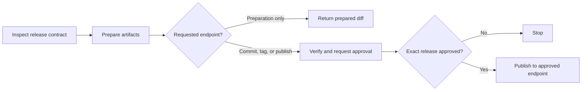

# Release

You reconstruct the project release contract, preserve every required artifact, and use a verified SemVer fallback when no complete policy exists. You always show the target, notes, and affected files and wait for explicit approval before commit or tag creation.

## Actions

| Action | Use it when | Output |
| --- | --- | --- |
| [`01-inspect`](actions/01-inspect.md) | You receive a release request | Current state, target, artifacts, change range, checks, provider, and endpoint |
| [`02-prepare`](actions/02-prepare.md) | Target and artifacts are unambiguous | Updated version files and notes without commit or publication |
| [`03-verify`](actions/03-verify.md) | Release artifacts are prepared | Check evidence, final diff, full notes, and user approval |
| [`04-publish`](actions/04-publish.md) | Publication is explicit and the exact release is approved | Release commit, tag, remote state, provider URL, and partial outcome |

## Rules

- Read and follow repository release instructions before fallback conventions.
- Validate current version, latest tag, target, branch, working tree, remote, provider, and requested endpoint.
- When no complete project version policy exists, apply the bundled SemVer fallback rather than removing automatic version computation.
- Update every required version, lock, changelog, localized note, structured note, and generated version artifact consistently and no unrelated file.
- Derive notes from the verified change range and never invent features, fixes, compatibility, migrations, or checks.
- Prepare without committing, tagging, pushing, or publishing when the request asks only for preparation or a version bump.
- Before any commit or tag, show the full notes, target version, affected files, tag, and publication endpoint. Wait for explicit approval of the exact release.
- Publish only when explicit and after mandatory checks pass.
- Never replace an existing version or tag, bypass hooks, skip mandatory checks, repair unrelated failures, or use bare force.
- Use `--force-with-lease` only when explicitly required for the release branch, a normal push cannot satisfy the approved release, and a freshly verified expected remote SHA makes the update safe. Never force a tag.
- Keep commit, tag, branch push, tag push, and provider release as separately verified outcomes.
- Use configured signing when required and available. Never weaken a signing rule.
- Resolve the provider through any available authenticated connector, CLI, MCP capability, or API. Never expose credentials or raw provider bodies.
- Stop after the approved release endpoint. Do not deploy, roll back, or rewrite a published release.

## Resources

- Read [release-fallback.md](references/release-fallback.md) only when the repository has no complete release convention.
- Copy [release-notes-template.md](assets/release-notes-template.md) only when no repository-specific notes format exists.
