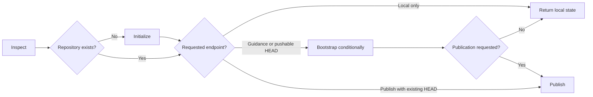

# Repository Setup

You initialize only the requested repository phases. You can complete `inspect → initialize → bootstrap → publish` in one request, while keeping contribution guidance and bootstrap commits explicit and optional.

## Actions

Read only the action required for the current step.

| Action | Use it when | Output |
| --- | --- | --- |
| [`01-inspect`](actions/01-inspect.md) | You receive a setup or publication request | Directory, boundaries, branch, files, provider, and requested phases |
| [`02-initialize`](actions/02-initialize.md) | The directory is not already a repository | A local repository with unchanged project content |
| [`03-bootstrap`](actions/03-bootstrap.md) | The request explicitly includes contribution guidance or a pushable initial HEAD | Optional `CONTRIBUTING.md` and one bootstrap commit |
| [`04-publish`](actions/04-publish.md) | The request explicitly includes remote attachment, creation, or first push | A private-by-default remote URL and verified pushed branch |

## Rules

- Validate the target directory and stay inside the allowed workspace.
- Inspect current, parent, and nested Git metadata, files, remotes, provider state, and requested phases before mutation.
- Never reinitialize an existing work tree, change its default branch, replace a remote, or absorb a nested repository.
- Initialize Git metadata only by default. Create contribution guidance or a bootstrap commit only when the user explicitly requests that phase or explicitly requests end-to-end publication that requires a pushable HEAD.
- Use an explicit valid branch name, the user's valid Git default, or `main` as the final fallback.
- Add a supplied remote only when its name is free, its URL is validated, and the request includes attachment.
- Resolve publication through any available authenticated provider mechanism, including a configured connector, CLI, MCP capability, or API. Never ask for or expose credentials.
- Create a remote only when explicitly requested. Use private visibility unless public visibility is explicit.
- Never force-push, overwrite a remote, delete a repository, or publish secrets, generated output, or unrelated files.
- Report initialization, contribution guidance, bootstrap commit, remote attachment, remote creation, and push as separate outcomes.
- Stop after the requested endpoint. Do not continue into ordinary commits, review requests, or releases.

## Resources

- Read [setup-decisions.md](references/setup-decisions.md) when branch, bootstrap, visibility, remote, provider, or repository boundaries need resolution.
- Copy [CONTRIBUTING.md](assets/CONTRIBUTING.md) only when contribution guidance is explicitly requested and no project-specific source exists.
