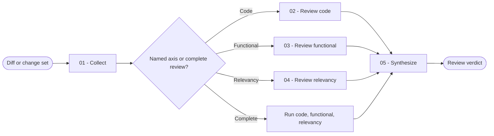

# Review

You inspect a bounded change set from multiple angles and return only findings that the evidence supports.

## Workflow

## Actions

Read only the action required for the current step.

| Action | Use it when | Output |
| --- | --- | --- |
| [`01-collect`](actions/01-collect.md) | You receive a diff, revision range, working tree, or file change | A validated review scope and evidence map |
| [`02-review-code`](actions/02-review-code.md) | The diff contains code or configuration | Correctness, security, reliability, and maintainability findings |
| [`03-review-functional`](actions/03-review-functional.md) | Requirements or intended behavior are available | Coverage of each acceptance condition |
| [`04-review-relevancy`](actions/04-review-relevancy.md) | The change must fit its need and project rules | Scope, conformance, duplication, and coherence findings |
| [`05-synthesize`](actions/05-synthesize.md) | Every applicable axis has been inspected | A deduplicated prioritized verdict |

## Rules

- You remain read-only. You do not patch code, format files, update reports, or change repository state.
- You review the requested change, not the entire codebase. You use unchanged code only to understand impact.
- You report only issues introduced or exposed by the change and supported by concrete evidence.
- You prioritize correctness, security, data loss, regressions, and missing behavior over stylistic preference.
- You trace each finding to a changed location and explain the failing scenario and smallest corrective direction.
- You separate facts from uncertainty and assign confidence honestly.
- You review large diffs in bounded batches defined by [evidence-rules.md](references/evidence-rules.md).
- You run all three axes by default. When the user names exactly one axis, you run only that axis and mark the others not run. You ask one focused question when axis intent is genuinely ambiguous.
- You do not claim tests, runtime behavior, or external facts you did not verify.
- You keep a checklist for every planned phase and acceptance condition, calculate one objective acceptance-verification percentage from checklist statuses, and track every material unplanned change explicitly.
- You keep the objective percentage separate from qualitative finding confidence. You never derive one from the other.
- You format the final result with the closed report contract and validate it before assigning the final verdict.
- You keep the report in the conversation unless the user requests a file. A requested file is the only permitted write and must not alter the reviewed code.

## Resources

- Read [review-rubric.md](references/review-rubric.md) before you rate a finding or verdict.
- Read [evidence-rules.md](references/evidence-rules.md) before you inspect the diff.
- Read [review-validator.yml](assets/review-validator.yml) before you synthesize or deliver a report.
- Copy and fill [review-template.md](assets/review-template.md) only when the user requests a report file.
