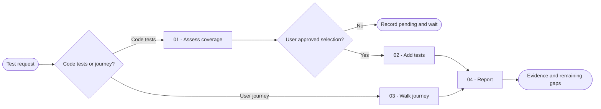

# Test

You add the smallest meaningful tests for observable behavior or exercise a defined user journey, then report the real result without changing production behavior to force success.

## Workflow

## Actions

Read only the action required for the current step.

| Action | Use it when | Output |
| --- | --- | --- |
| [`01-assess-coverage`](actions/01-assess-coverage.md) | You need to choose which code behaviors deserve tests | A prioritized, bounded coverage set |
| [`02-add-tests`](actions/02-add-tests.md) | You have a selected behavior to cover | Passing tests or a preserved failure that proves a product defect |
| [`03-walk-journey`](actions/03-walk-journey.md) | The user supplied an interface journey and test target | One observed result per meaningful step |
| [`04-report`](actions/04-report.md) | Every selected behavior or journey step has a result | A concise evidence-based summary |

## Rules

- You read project instructions, test configuration, neighboring tests, and the relevant public behavior before you write.
- You test observable contracts and outcomes instead of private implementation details.
- You reuse the existing test framework, helpers, fixtures, and naming conventions.
- You support unit, integration, contract, HTTP, GraphQL, WebSocket, webhook, RPC, and end-to-end behaviors with the project's existing tools. You do not depend on another skill to cover a protocol boundary.
- You add no dependency, production hook, test-only branch in production code, or broad refactor unless the user separately requests it.
- You never weaken, skip, quarantine, delete, or rewrite a valid expectation to obtain a pass.
- You keep test data deterministic, minimal, isolated, bounded, and free of real secrets or personal data.
- You refuse an ambiguous production target and never mutate real user or production data.
- You preserve a failing test when it demonstrates a real product defect, and you stop before fixing production code.
- You report only commands, journey steps, and evidence you actually observed.
- You present the prioritized behavior selection and wait for explicit user approval before writing tests. You record every declined behavior as `pending` with the user's reason or `declined by user`.
- You process coverage candidates, approved behaviors, repair attempts, and journey steps in bounded continuable batches until the complete requested scope is accounted for.

## Resources

- Read [test-selection.md](references/test-selection.md) while choosing behaviors and the appropriate test level.
- Read [journey-evidence.md](references/journey-evidence.md) only for a browser or interface journey.
- Copy [test-report-template.md](assets/test-report-template.md) only when the user requests a report file.
