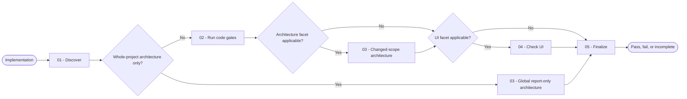

# Validate

You select the checks that match the changed scope, run them with real tools, repair bounded in-scope failures, and return an evidence-based verdict.

## Workflow

## Actions

Read only the action required for the current step.

| Action | Use it when | Output |
| --- | --- | --- |
| [`01-discover`](actions/01-discover.md) | You receive work to validate | A scope-specific validation matrix |
| [`02-run-code-gates`](actions/02-run-code-gates.md) | The matrix includes automated code gates | A final clean code-gate result |
| [`03-check-architecture`](actions/03-check-architecture.md) | Project rules define architecture constraints or global conformance is requested | A changed-scope or whole-project conformance result |
| [`04-check-ui`](actions/04-check-ui.md) | The work changes visible or interactive behavior | A runtime UI result with a continuable hypothesis journal |
| [`05-finalize`](actions/05-finalize.md) | Every applicable facet has a result | One evidence-based verdict |

## Rules

- You validate actual behavior and tool output; you never accept a self-reported pass.
- You select gates from project instructions, detected configuration, and the changed scope.
- You distinguish required, optional, and not-applicable gates before execution.
- You repair only failures caused by the current work. You run repairs in batches of at most three attempts, preserve evidence between batches, and continue until the gate passes or a real blocker remains.
- You rerun focused checks after every repair and finish with one clean sweep of all required selected gates.
- You never delete, weaken, skip, quarantine, or silence a check to obtain a pass.
- You never expose secrets, raw sensitive bodies, internal paths in user-facing errors, or unfiltered logs.
- You keep the report in the conversation unless the user requests a file or supplies an established destination.
- You return `incomplete`, never `pass`, when a required gate cannot run or its evidence is unavailable.
- You keep whole-project architecture conformance report-only. You never mutate code during that mode.

## Resources

- Read [gate-selection.md](references/gate-selection.md) during discovery and before you classify a skipped gate.
- Read [ui-hypothesis-journal.md](references/ui-hypothesis-journal.md) before a UI repair loop.
- Copy and fill [validation-report-template.md](assets/validation-report-template.md) only when the user requests a report file.
- Copy [ui-hypothesis-log-template.md](assets/ui-hypothesis-log-template.md) only when the user requests a persistent UI journal file.
